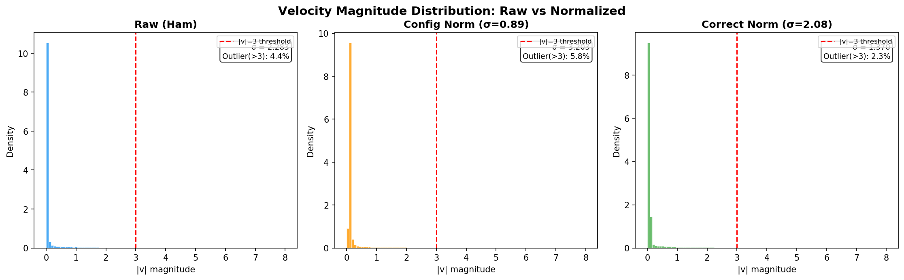
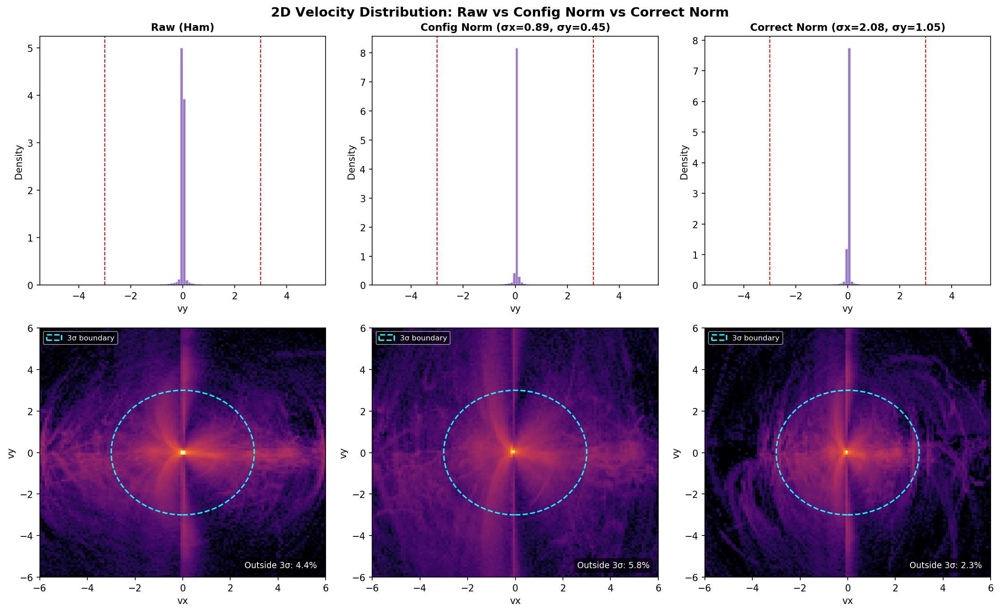
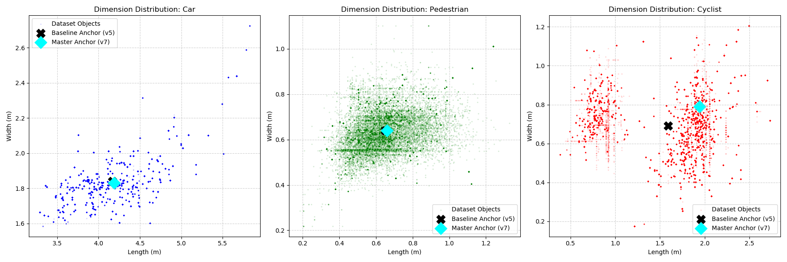
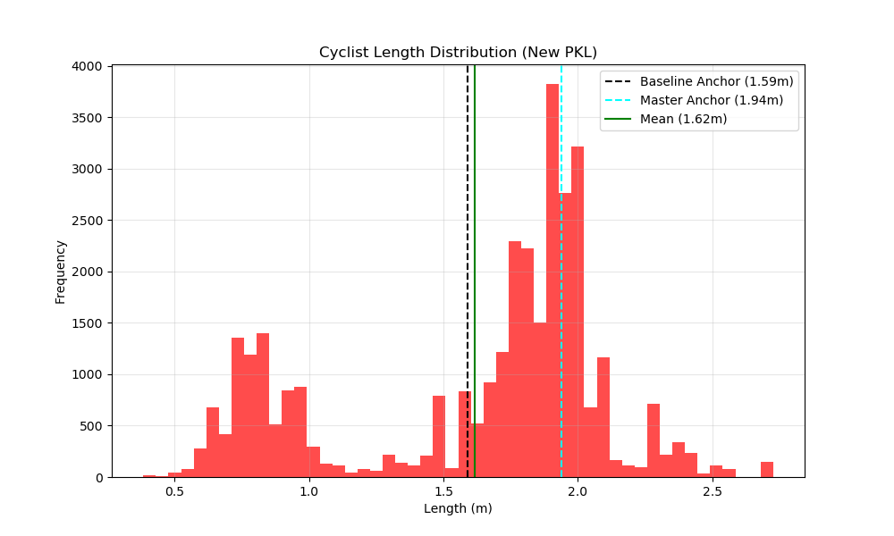

<div align="center">

# SpatialPillar-IUC: Spatially-Enhanced Radar 3D Object Detection

**Geometric features, velocity-aware attention, and deformable convolutions for 4D radar**

[](https://www.python.org/)
[](https://pytorch.org/)
[](LICENSE)

</div>

> **This work is currently under review.**
> Pre-trained model weights and full reproduction details will be released upon paper acceptance.
> Please do not use or redistribute without written permission from the authors.

---

## Table of Contents

- [Overview](#overview)
- [Architecture](#architecture)
- [Key Contributions](#key-contributions)
- [Results](#results)
  - [SOTA Comparison (VoD)](#sota-comparison-on-vod)
  - [Ablation Studies](#ablation-studies)
- [Installation](#installation)
- [Dataset Preparation](#dataset-preparation)
- [Training & Evaluation](#training--evaluation)
- [Visualization Tools](#visualization-tools)
- [Changelog](#changelog)
- [Citation](#citation)
- [Acknowledgement](#acknowledgement)

---

## Overview

**SpatialPillar-IUC** extends [RadarPillars](https://arxiv.org/abs/2408.05020) (Gillen et al., IROS 2024) with a series of spatially-aware modules designed to address the unique challenges of radar-only 3D object detection. Built on [OpenPCDet](https://github.com/open-mmlab/OpenPCDet), the project name reflects the core architecture:

- **Spatial** — geometric spatial features (GeoSPA), spatial-context attention (CQCA), and spatially-adaptive deformable convolutions (DCN)
- **Pillar** — the pillar-based point cloud representation from PointPillars
- **IUC** — the three key modules stacked in the 3D backbone: **I**ntra-pillar attention, **U**nified velocity clustering, and **C**luster-query cross-attention

**Supported Datasets:**

| Dataset | Classes | Radar Features | Frames |
|---|---|---|---|
| **View-of-Delft (VoD)** | Car, Pedestrian, Cyclist | x, y, z, RCS, v_r, v_r_comp, time | 5-frame accumulation |
| **Astyx HiRes2019** | Car, Pedestrian | x, y, z, RCS, v_r, v_x, v_y | Single frame |

---

## Architecture

SpatialPillar-IUC introduces five new modules on top of the RadarPillars baseline:

<div align="center">

```
Input: Radar Point Cloud (N, 7)
         │
         ▼
┌─────────────────────────┐
│  GeoSPA Features         │  KNN covariance eigenvalue analysis
│  → scatterness,          │  Lalonde geometric descriptors (k=16)
│    linearness,           │  Appended as 3 extra point features
│    surfaceness           │
└─────────┬───────────────┘
          ▼
┌─────────────────────────┐
│  PillarVFE               │  Voxelization + Doppler Decomposition
│  vr_comp → vx, vy        │  φ = atan2(y, x), vx = vr·cos(φ), vy = vr·sin(φ)
└─────────┬───────────────┘
          ▼
┌─────────────────────────┐
│  PillarAttention (I)     │  Global Self-Attention (C=32, H=1)
│  + LayerNorm + FFN       │  Key padding mask for sparse radar
└─────────┬───────────────┘
          ▼
┌─────────────────────────┐
│  CQCAModule (U+C)        │  DBSCAN velocity clustering (eps=0.5)
│  Cluster-Query            │  Cross-attention: pillars → velocity clusters
│  Cross-Attention          │  (C=32, H=2, max 32 clusters)
└─────────┬───────────────┘
          ▼
┌─────────────────────────┐
│  PointPillarScatter      │  Sparse-to-Dense BEV projection
└─────────┬───────────────┘
          ▼
┌─────────────────────────┐
│  DCNBEVBackbone          │  Deformable Conv BEV backbone
│  + KDEDensityBranch      │  + Gaussian KDE density map fusion
└─────────┬───────────────┘
          ▼
┌─────────────────────────┐
│  CenterHead              │  Anchor-free heatmap-based detection
└─────────┬───────────────┘
          ▼
    3D Bounding Boxes
```

</div>

### Configuration Variants

| Config | GeoSPA | PillarAttn | CQCA | DCN | KDE | Head | Distillation |
|---|:---:|:---:|:---:|:---:|:---:|---|:---:|
| `vod_radarpillar.yaml` | | x | | | | AnchorHead | |
| `spatialpillar_centerhead.yaml` | | x | | | | CenterHead | |
| `spatialpillar_dcn.yaml` | | x | | x | | AnchorHead | |
| `spatialpillar_distill.yaml` | | x | | | | AnchorHead | x |
| **`spatialpillar_full.yaml`** | **x** | **x** | **x** | **x** | **x** | **CenterHead** | optional |

---

## Key Contributions

### 1. GeoSPA: Geometric Spatial Features

Inspired by MUFASA. Computes **Lalonde geometric descriptors** from each point's KNN neighborhood (k=16) via covariance eigenvalue analysis:

```
λ1 ≥ λ2 ≥ λ3  (eigenvalues of local covariance matrix)

scatterness = λ3 / λ1    → high for isotropically distributed points
linearness  = (λ1-λ2)/λ1 → high for edge-like / pole structures
surfaceness = (λ2-λ3)/λ1 → high for planar structures
```

These 3 features are appended to each point, providing local geometry context that pure pillar pooling loses.

### 2. PillarAttention: Intra-Pillar Self-Attention

Global multi-head self-attention across all active pillars. Key design: **key padding masks** prevent empty pillar positions from corrupting attention scores — critical for the extreme sparsity of radar point clouds (~200 points vs LiDAR's ~100k).

### 3. CQCA: Cluster-Query Cross-Attention

Inspired by MAFF-Net. Groups pillars into velocity clusters via DBSCAN on radial velocity, then applies **cross-attention** from pillar features (Q) to velocity-cluster centroids (K, V). This explicitly leverages Doppler grouping to associate spatially-separated points that share motion patterns.

### 4. DCNBEVBackbone: Deformable Convolutions

Replaces the first convolution in each BEV encoder block with `DeformConv2d`. The learnable offsets allow spatially-adaptive receptive fields, better handling the irregular spatial distribution of radar data. Offset convolutions are zero-initialized so training starts as standard convolutions.

### 5. KDE Density Branch

Inspired by SMURF. A parallel branch that estimates point density via 2D Gaussian KDE on the BEV grid, processes it through a small CNN, and concatenates with BEV features. Provides explicit density awareness to the detection head.

### 6. Doppler Velocity Decomposition

Radar measures only **radial velocity** (v_r). We decompose it into Cartesian components in the VFE layer:

```
φ = atan2(y, x + 1e-6)
vx = v_r_comp · cos(φ)
vy = v_r_comp · sin(φ)
```

### 7. Physics-Consistent Augmentation Fix

Fixed a critical bug in `augmentor_utils.py` where `random_flip` and `global_rotation` were incorrectly transforming time values instead of velocity vectors. The original code assumed columns 5–6 are `[vx, vy]` (nuScenes convention), but for VoD radar they are `[v_r_comp, time]`.

### 8. LiDAR-to-Radar Knowledge Distillation

Inspired by SCKD. Optional teacher-student framework where a pretrained LiDAR PointPillar guides the radar model via:
- **Feature mimicry loss**: MSE between teacher/student BEV feature maps
- **Response distillation loss**: Temperature-scaled KL divergence on classification logits

### 9. CenterHead: Anchor-Free Detection

Replaces `AnchorHeadSingle` with heatmap-based `CenterHead` for anchor-free detection, avoiding the need for hand-tuned anchor sizes.

---

## Results

### SOTA Comparison on VoD

**Entire Annotated Area (EAA)** — 3D AP (%) at IoU: Car=0.50, Ped/Cyc=0.25

| Rank | Method | Year | Car | Ped | Cyc | mAP |
|:---:|---|---|:---:|:---:|:---:|:---:|
| 1 | MAFF-Net | 2025 RA-L | 42.3 | **46.8** | **74.7** | **54.6** |
| 2 | SCKD | 2025 AAAI | 41.89 | 43.51 | 70.83 | 52.08 |
| 3 | RadarGaussianDet3D | 2025 | 40.7 | 42.4 | 73.0 | 52.0 |
| 5 | SMURF | 2023 TIV | **42.31** | 39.09 | 71.50 | 50.97 |
| 6 | RadarPillars (paper) | 2024 IROS | 41.1 | 38.6 | 72.6 | 50.70 |
| **10** | **Ours (default, e58)** | **--** | **36.29** | **41.09** | **68.90** | **48.76** |
| **11** | **Ours (vel. decomp, e56)** | **--** | **35.43** | **39.96** | **70.76** | **48.72** |
| 12 | CenterPoint (baseline) | -- | 33.87 | 39.01 | 66.85 | 46.58 |
| 13 | PointPillars (baseline) | -- | 37.92 | 31.24 | 65.66 | 44.94 |

### Our Results vs. Paper

| Configuration | Car | Ped | Cyc | mAP |
|---|:---:|:---:|:---:|:---:|
| RadarPillars paper (5-frame) | **41.1** | 38.6 | **72.6** | **50.7** |
| Ours — default (e58) | 36.29 | **41.09** (+2.5) | 68.90 | 48.76 |
| Ours — vel. decomp (e56) | 35.43 | 39.96 (+1.4) | 70.76 | 48.72 |

**Key observations:**
- Pedestrian detection **exceeds** the paper by +1.4 to +2.5 AP
- Velocity decomposition boosts Cyclist AP significantly: 68.90 → **70.76** (+1.86)
- Overall mAP gap is **-1.9** from the original paper
- Cyclist detection shows the largest gap (-1.8 to -3.7 AP)

### 3D AP Evolution (Epoch 30-40)

<p align="center">
  
  <br><em>Training is highly stable: Cyclist AP stays in 19.5-20.4 range with minimal oscillation</em>
</p>

---

### Ablation Studies

#### Augmentor Bug Fix

| Experiment | Config | Car 3D | Ped 3D | Cyclist 3D |
|---|---|:---:|:---:|:---:|
| boxq_v7 (flip off, buggy) | Single anchor, NMS=0.05 | 38.58 | 0.60 | 0.00 |
| **return_v5** (flip on, bug fixed) | Single anchor, NMS=0.01 | 35.35 | **31.99** | **17.65** |

> Pedestrian: 0.60 → 32.00 | Cyclist: 0.00 → 17.65

#### Dual Cyclist Anchor

| Experiment | Car 3D | Ped 3D | Cyclist 3D | Weighted Mean |
|---|:---:|:---:|:---:|:---:|
| return_v5_epoch80 (single anchor) | 34.31 | 34.32 | 18.08 | 26.20 |
| **2peakcyclist** (dual anchor) | 33.60 | **35.99** | **20.30** | **27.67** |

> Cyclist: 18.08 → 20.30 (+2.22 AP, +12.3%) | Recall@0.3: 0.40 → 0.47

#### Velocity Normalization Analysis

The `v_r_comp` value is decomposed into vx, vy in the VFE layer. Normalization scales these via `(value - μ) / σ`. However, the config's mean/std values didn't match the actual data distribution:

| Parameter | Config (old) | Actual Data | Ratio |
|---|:---:|:---:|:---:|
| vx std | 0.891 | **1.847** | 0.48x |
| vy std | 0.453 | **0.944** | 0.48x |

Since config std was half the actual std, normalization was **amplifying** the distribution instead of compressing it.

<p align="center">
  
  <br><em>Config normalization increases outliers (5.8%) compared to raw (4.4%). Correct normalization reduces them to 2.3%</em>
</p>

<p align="center">
  
  <br><em>Top: vy histogram. Bottom: vx-vy heatmap (log-scale), cyan dashed circle = 3σ boundary</em>
</p>

| | σ (std) | Outlier ratio (\|v\|>3) |
|---|:---:|:---:|
| Raw | 2.075 | 4.1% |
| Config Norm (σ=0.89) | 2.328 | **4.7% (increased)** |
| Correct Norm (σ=2.08) | 1.000 | **1.4% (decreased)** |

#### Normalization ON vs OFF Training Results

Even with incorrect std values, normalization ON outperforms OFF (vx/vy balance effect):

| Class | Norm ON (e128) | Norm OFF (e128_tek_norm) | Diff |
|---|:---:|:---:|:---:|
| Car | 35.27 | 35.00 | +0.27 |
| Ped | 34.27 | 33.17 | **+1.10** |
| Cyc | 19.48 | 18.76 | **+0.72** |

---

## Installation

**Requirements:** Python 3.8+, PyTorch 2.4+, CUDA 12.x, spconv 2.3.6

```bash
# Create virtual environment
python -m venv .venv
source .venv/bin/activate
python -m pip install -U pip

# Install OpenPCDet with CUDA extensions
python setup.py develop

# Install WandB for experiment tracking (optional)
pip install wandb
```

See [docs/INSTALL.md](docs/INSTALL.md) for detailed instructions.

---

## Dataset Preparation

### View-of-Delft (VoD)

```
data/VoD/view_of_delft_PUBLIC/radar_5frames/
├── ImageSets/
│   ├── train.txt
│   ├── val.txt
│   └── test.txt
├── training/
│   ├── velodyne/          # Radar point clouds (.bin)
│   ├── label_2/           # 3D annotations
│   ├── calib/             # Calibration files
│   └── image_2/           # Camera images (optional)
└── testing/
    └── velodyne/
```

```bash
# Generate info files and GT database
python -m pcdet.datasets.vod.vod_dataset create_vod_infos \
    tools/cfgs/dataset_configs/vod_dataset_radar.yaml
```

### Astyx HiRes2019

```
data/astyx/
├── ImageSets/
│   ├── train.txt
│   ├── val.txt
│   └── test.txt
├── training/
│   └── radar/             # Radar point clouds (.bin)
└── testing/
```

```bash
python -m pcdet.datasets.astyx.astyx_dataset create_astyx_infos \
    tools/cfgs/dataset_configs/astyx_dataset_radar.yaml
```

---

## Training & Evaluation

### SpatialPillar-IUC Full Model (VoD)

```bash
CUDA_VISIBLE_DEVICES=0 python tools/train.py \
    --cfg_file tools/cfgs/vod_models/spatialpillar_full.yaml \
    --batch_size 16

# With WandB experiment tracking
CUDA_VISIBLE_DEVICES=0 python tools/train.py \
    --cfg_file tools/cfgs/vod_models/spatialpillar_full.yaml \
    --batch_size 16 --use_wandb
```

### RadarPillar Baseline (VoD)

```bash
CUDA_VISIBLE_DEVICES=0 python tools/train.py \
    --cfg_file tools/cfgs/vod_models/vod_radarpillar.yaml \
    --batch_size 16
```

### Ablation Variants

```bash
# CenterHead only (no CQCA/DCN)
python tools/train.py --cfg_file tools/cfgs/vod_models/spatialpillar_centerhead.yaml

# DCN backbone
python tools/train.py --cfg_file tools/cfgs/vod_models/spatialpillar_dcn.yaml

# LiDAR distillation (requires teacher checkpoint)
python tools/train.py --cfg_file tools/cfgs/vod_models/spatialpillar_distill.yaml
```

### Astyx Training

```bash
CUDA_VISIBLE_DEVICES=0 python tools/train.py \
    --cfg_file tools/cfgs/astyx_models/astyx_radarpillar.yaml \
    --batch_size 4
```

### Evaluation

```bash
CUDA_VISIBLE_DEVICES=0 python tools/test.py \
    --cfg_file tools/cfgs/vod_models/spatialpillar_full.yaml \
    --ckpt <checkpoint_path>
```

### Key Hyperparameters

| Parameter | VoD (SpatialPillar) | Astyx |
|---|---|---|
| Voxel Size | 0.16 x 0.16 x 5.0 m | 0.2 x 0.2 x 4.0 m |
| Max Points/Voxel | 16 | 32 |
| Epochs | 60 | 160 |
| Learning Rate | 0.01 | 0.003 |
| Optimizer | adam_onecycle | adam_onecycle |
| Early Stopping | 30 epoch patience | -- |
| NMS Threshold | 0.1 | 0.01 |
| GeoSPA k-neighbors | 16 | -- |
| CQCA velocity eps | 0.5 | -- |

---

## Project Structure

```
SpatialPillar-IUC/
├── pcdet/
│   ├── datasets/
│   │   ├── vod/                           # VoD dataset class
│   │   ├── astyx/                         # Astyx dataset class
│   │   ├── augmentor/
│   │   │   └── augmentor_utils.py         # Bug-fixed velocity-aware augmentation
│   │   └── processor/
│   │       ├── data_processor.py          # + compute_geospa_features step
│   │       └── geospa_features.py         # [NEW] Lalonde geometric features
│   ├── models/
│   │   ├── backbones_3d/
│   │   │   ├── pillar_attention.py        # [NEW] Intra-pillar self-attention
│   │   │   ├── cqca_module.py             # [NEW] Velocity cluster cross-attention
│   │   │   ├── velocity_clustering.py     # [NEW] DBSCAN velocity grouping
│   │   │   └── vfe/pillar_vfe.py          # [EXT] Doppler decomposition + offsets
│   │   ├── backbones_2d/
│   │   │   ├── dcn_bev_backbone.py        # [NEW] Deformable Conv BEV backbone
│   │   │   └── kde_density_branch.py      # [NEW] KDE density side-branch
│   │   └── detectors/
│   │       └── distillation_pointpillar.py  # [NEW] Teacher-student distillation
│   └── utils/
│       └── distillation_utils.py          # [NEW] Mimicry + response losses
├── tools/
│   ├── cfgs/vod_models/
│   │   ├── vod_radarpillar.yaml           # Baseline config
│   │   ├── spatialpillar_centerhead.yaml  # + CenterHead
│   │   ├── spatialpillar_dcn.yaml         # + DCN backbone
│   │   ├── spatialpillar_distill.yaml     # + LiDAR distillation
│   │   └── spatialpillar_full.yaml        # Full SpatialPillar-IUC
│   ├── train.py / test.py
│   ├── visualize_bev.py                   # BEV prediction visualization
│   ├── visualize_anchors.py               # Anchor-size analysis
│   └── plot_cyclist_dist.py               # Cyclist distribution analysis
└── docs/
    └── visualizations/                    # Result plots and figures
```

---

## Visualization Tools

### BEV (Bird's Eye View) Visualization

Visualize model predictions overlaid on radar point clouds. GT boxes are solid lines, predictions are dashed. Points are colored by RCS value.

```bash
python tools/visualize_bev.py \
    --pred_dir output/cfgs/vod_models/spatialpillar_full/<exp>/eval/epoch_<N>/val/default/final_result/data \
    --samples 00315 00107 \
    --score_thresh 0.15 \
    --output_dir output_bev
```

<p align="center">
  
  <br><em>Sample 00315 — Dense urban scene (cars + cyclists + pedestrians)</em>
</p>

<p align="center">
  
  <br><em>Sample 00107 — Close-range cyclist cluster</em>
</p>

### Anchor Verification

Analyze dataset object size distributions and verify anchor box alignment.

```bash
python tools/visualize_anchors.py    # Dimension scatter plot with anchors
python tools/plot_cyclist_dist.py    # Cyclist length histogram
```

<p align="center">
  
  <br><em>Black cross = Baseline anchor (1.59m, centered on data). Blue diamond = Master anchor (1.94m, shifted from center)</em>
</p>

<p align="center">
  
  <br><em>Bimodal cyclist distribution: stationary bicycles vs. moving riders</em>
</p>

### AP Evolution Plots

```bash
python visualize_radar_logs.py \
    --logs output/cfgs/vod_models/spatialpillar_full/<exp>/eval/epoch_*/val/default/log_eval_*.txt \
    --output output_plots
```

### Velocity Normalization Analysis

```bash
python tools/generate_velocity_norm_plots.py
```

---

## Changelog

| Date | Description |
|---|---|
| 2026-02 | SpatialPillar-IUC: GeoSPA + PillarAttention + CQCA + DCN + KDE + CenterHead |
| 2026-02 | CQCAModule: DBSCAN velocity clustering + cross-attention |
| 2026-02 | DCNBEVBackbone: deformable convolutions for BEV feature extraction |
| 2026-02 | KDEDensityBranch: Gaussian KDE density map fusion |
| 2026-02 | LiDAR-to-Radar knowledge distillation framework |
| 2026-02 | GeoSPA geometric features (scatterness, linearness, surfaceness) |
| 2026-02 | CenterHead anchor-free detection integration |
| 2026-02 | Velocity decomposition: vr_comp → vx, vy in VFE layer |
| 2026-02 | Dual Cyclist anchor strategy for diverse sub-types |
| 2026-02 | Augmentor bug fix: correct velocity index handling in flip/rotation |
| 2026-02 | BEV visualization tool (`tools/visualize_bev.py`) |
| 2026-02 | WandB integration with `--use_wandb` flag |
| 2026-02 | VoD radar pipeline: dataset config, info generation |
| 2026-01 | Astyx radar pipeline: 7-feature point loader, velocity-aware augmentations |

---

## Citation

```bibtex
@inproceedings{gillen2024radarpillars,
  title     = {RadarPillars: Efficient Object Detection from 4D Radar Point Clouds},
  author    = {Gillen, Julius and Bieder, Manuel and Stiller, Christoph},
  booktitle = {Proc. IEEE/RSJ Int. Conf. Intelligent Robots and Systems (IROS)},
  year      = {2024}
}
```

```bibtex
@misc{openpcdet2020,
  title  = {OpenPCDet: An Open-source Toolbox for 3D Object Detection from Point Clouds},
  author = {OpenPCDet Development Team},
  year   = {2020},
  howpublished = {\url{https://github.com/open-mmlab/OpenPCDet}}
}
```

---

## Acknowledgement

This project is built upon [OpenPCDet](https://github.com/open-mmlab/OpenPCDet). The following works inspired key components:

- **RadarPillars** (Gillen et al., IROS 2024) — base architecture
- **MAFF-Net** (2025 RA-L) — velocity-aware cross-attention (CQCA)
- **MUFASA** — geometric spatial features (GeoSPA)
- **SMURF** (2023 TIV) — KDE density branch
- **SCKD** (2025 AAAI) — knowledge distillation framework

---

## License

`OpenPCDet` is released under the [Apache 2.0 license](LICENSE).
