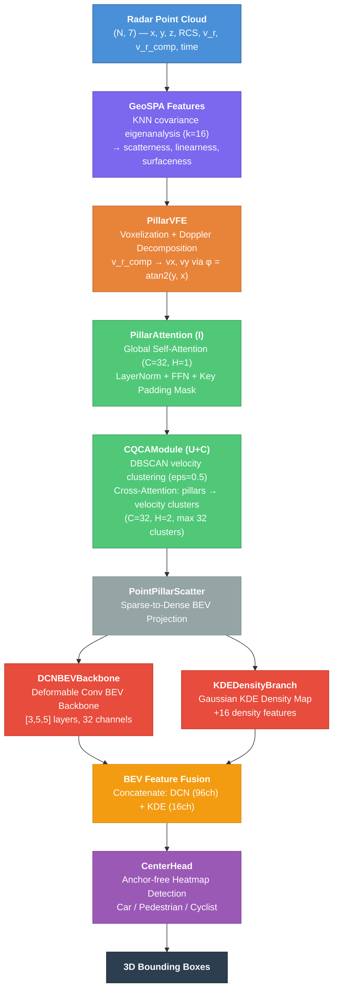
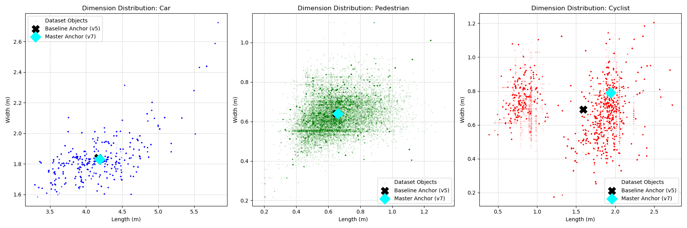
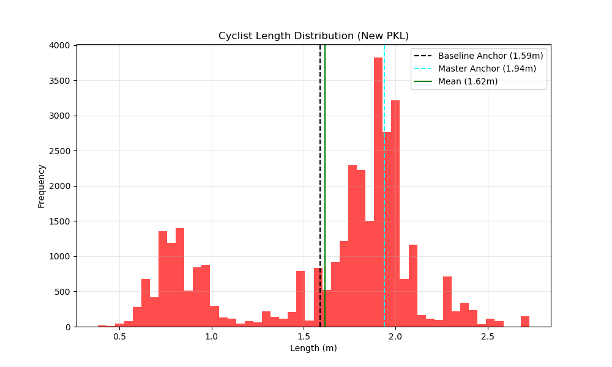

<div align="center">

# SpatialPillar-IUC: Spatially-Enhanced Radar 3D Object Detection

**Geometric features, velocity-aware attention, and deformable convolutions for 4D radar**

[](https://www.python.org/)
[](https://pytorch.org/)
[](LICENSE)

</div>

> **This work is currently under review.**
> Pre-trained model weights and full reproduction details will be released upon paper acceptance.
> Please do not use or redistribute without written permission from the authors.

---

## Table of Contents

- [Overview](#overview)
- [Architecture](#architecture)
- [Key Contributions](#key-contributions)
- [Results](#results)
  - [SOTA Comparison (VoD)](#sota-comparison-on-vod)
  - [Ablation Studies](#ablation-studies)
- [Installation](#installation)
- [Dataset Preparation](#dataset-preparation)
- [Training & Evaluation](#training--evaluation)
- [Visualization Tools](#visualization-tools)
- [Changelog](#changelog)
- [Citation](#citation)
- [Acknowledgement](#acknowledgement)

---

## Overview

**SpatialPillar-IUC** extends [RadarPillars](https://arxiv.org/abs/2408.05020) (Gillen et al., IROS 2024) with a series of spatially-aware modules designed to address the unique challenges of radar-only 3D object detection. Built on [OpenPCDet](https://github.com/open-mmlab/OpenPCDet), the project name reflects the core architecture:

- **Spatial** — geometric spatial features (GeoSPA), spatial-context attention (CQCA), and spatially-adaptive deformable convolutions (DCN)
- **Pillar** — the pillar-based point cloud representation from PointPillars
- **IUC** — the three key modules stacked in the 3D backbone: **I**ntra-pillar attention, **U**nified velocity clustering, and **C**luster-query cross-attention

**Supported Datasets:**

| Dataset | Classes | Radar Features | Frames |
|---|---|---|---|
| **View-of-Delft (VoD)** | Car, Pedestrian, Cyclist | x, y, z, RCS, v_r, v_r_comp, time | 5-frame accumulation |
| **Astyx HiRes2019** | Car, Pedestrian | x, y, z, RCS, v_r, v_x, v_y | Single frame |

---

## Architecture

SpatialPillar-IUC introduces five new modules on top of the RadarPillars baseline:


```mermaid
graph TD
    INPUT["<b>Radar Point Cloud</b><br/>(N, 7) — x, y, z, RCS, v_r, v_r_comp, time"]

    GEOSPA["<b>GeoSPA Features</b><br/>KNN covariance eigenanalysis (k=16)<br/>→ scatterness, linearness, surfaceness"]

    VFE["<b>PillarVFE</b><br/>Voxelization + Doppler Decomposition<br/>v_r_comp → vx, vy via φ = atan2(y, x)"]

    ATTN["<b>PillarAttention (I)</b><br/>Global Self-Attention (C=32, H=1)<br/>LayerNorm + FFN + Key Padding Mask"]

    CQCA["<b>CQCAModule (U+C)</b><br/>DBSCAN velocity clustering (eps=0.5)<br/>Cross-Attention: pillars → velocity clusters<br/>(C=32, H=2, max 32 clusters)"]

    SCATTER["<b>PointPillarScatter</b><br/>Sparse-to-Dense BEV Projection"]

    DCN["<b>DCNBEVBackbone</b><br/>Deformable Conv BEV Backbone<br/>[3,5,5] layers, 32 channels"]

    KDE["<b>KDEDensityBranch</b><br/>Gaussian KDE Density Map<br/>+16 density features"]

    FUSION["<b>BEV Feature Fusion</b><br/>Concatenate: DCN (96ch) + KDE (16ch)"]

    HEAD["<b>CenterHead</b><br/>Anchor-free Heatmap Detection<br/>Car / Pedestrian / Cyclist"]

    OUTPUT["<b>3D Bounding Boxes</b>"]

    INPUT --> GEOSPA
    GEOSPA --> VFE
    VFE --> ATTN
    ATTN --> CQCA
    CQCA --> SCATTER
    SCATTER --> DCN
    SCATTER --> KDE
    DCN --> FUSION
    KDE --> FUSION
    FUSION --> HEAD
    HEAD --> OUTPUT

    style INPUT fill:#4a90d9,stroke:#2c5f8a,color:#fff
    style GEOSPA fill:#7b68ee,stroke:#5a4cbf,color:#fff
    style VFE fill:#e8833a,stroke:#c06a2e,color:#fff
    style ATTN fill:#50c878,stroke:#3a9a5c,color:#fff
    style CQCA fill:#50c878,stroke:#3a9a5c,color:#fff
    style SCATTER fill:#95a5a6,stroke:#7f8c8d,color:#fff
    style DCN fill:#e74c3c,stroke:#c0392b,color:#fff
    style KDE fill:#e74c3c,stroke:#c0392b,color:#fff
    style FUSION fill:#f39c12,stroke:#d68910,color:#fff
    style HEAD fill:#9b59b6,stroke:#7d3c98,color:#fff
    style OUTPUT fill:#2c3e50,stroke:#1a252f,color:#fff
```

**Renk kodlaması:**
🟣 Preprocessing (GeoSPA) · 🟠 VFE · 🟢 3D Backbone (I-U-C) · 🔴 2D Backbone (DCN + KDE) · 🟡 Fusion · 🟣 Detection Head

### Configuration Variants

| Config | GeoSPA | PillarAttn | CQCA | DCN | KDE | Head | Distillation |
|---|:---:|:---:|:---:|:---:|:---:|---|:---:|
| `vod_radarpillar.yaml` | | x | | | | AnchorHead | |
| `spatialpillar_centerhead.yaml` | | x | | | | CenterHead | |
| `spatialpillar_geospa.yaml` | x | x | | | | AnchorHead | |
| `spatialpillar_cqca.yaml` | | x | x | | | AnchorHead | |
| `spatialpillar_kde.yaml` | | x | | | x | AnchorHead | |
| `spatialpillar_dcn.yaml` | | x | | x | | AnchorHead | |
| `spatialpillar_centerhead_geospa.yaml` | x | x | | | | CenterHead | |
| `spatialpillar_centerhead_cqca.yaml` | | x | x | | | CenterHead | |
| `spatialpillar_distill.yaml` | | x | | | | AnchorHead | x |
| **`spatialpillar_full.yaml`** | **x** | **x** | **x** | **x** | **x** | **CenterHead** | optional |

---

## Key Contributions

### 1. GeoSPA: Geometric Spatial Features

Inspired by MUFASA. Computes **Lalonde geometric descriptors** from each point's KNN neighborhood (k=16) via covariance eigenvalue analysis:

```
λ1 ≥ λ2 ≥ λ3  (eigenvalues of local covariance matrix)

scatterness = λ3 / λ1    → high for isotropically distributed points
linearness  = (λ1-λ2)/λ1 → high for edge-like / pole structures
surfaceness = (λ2-λ3)/λ1 → high for planar structures
```

These 3 features are appended to each point, providing local geometry context that pure pillar pooling loses.

### 2. PillarAttention: Intra-Pillar Self-Attention

Global multi-head self-attention across all active pillars. Key design: **key padding masks** prevent empty pillar positions from corrupting attention scores — critical for the extreme sparsity of radar point clouds (~200 points vs LiDAR's ~100k).

### 3. CQCA: Cluster-Query Cross-Attention

Inspired by MAFF-Net. Groups pillars into velocity clusters via DBSCAN on radial velocity, then applies **cross-attention** from pillar features (Q) to velocity-cluster centroids (K, V). This explicitly leverages Doppler grouping to associate spatially-separated points that share motion patterns.

### 4. DCNBEVBackbone: Deformable Convolutions

Replaces the first convolution in each BEV encoder block with `DeformConv2d`. The learnable offsets allow spatially-adaptive receptive fields, better handling the irregular spatial distribution of radar data. Offset convolutions are zero-initialized so training starts as standard convolutions.

### 5. KDE Density Branch

Inspired by SMURF. A parallel branch that estimates point density via 2D Gaussian KDE on the BEV grid, processes it through a small CNN, and concatenates with BEV features. Provides explicit density awareness to the detection head.

### 6. Doppler Velocity Decomposition

Radar measures only **radial velocity** (v_r). We decompose it into Cartesian components in the VFE layer:

```
φ = atan2(y, x + 1e-6)
vx = v_r_comp · cos(φ)
vy = v_r_comp · sin(φ)
```

### 7. Physics-Consistent Augmentation Fix

Fixed a critical bug in `augmentor_utils.py` where `random_flip` and `global_rotation` were incorrectly transforming time values instead of velocity vectors. The original code assumed columns 5–6 are `[vx, vy]` (nuScenes convention), but for VoD radar they are `[v_r_comp, time]`.

### 8. LiDAR-to-Radar Knowledge Distillation

Inspired by SCKD. Optional teacher-student framework where a pretrained LiDAR PointPillar guides the radar model via:
- **Feature mimicry loss**: MSE between teacher/student BEV feature maps
- **Response distillation loss**: Temperature-scaled KL divergence on classification logits

### 9. CenterHead: Anchor-Free Detection

Replaces `AnchorHeadSingle` with heatmap-based `CenterHead` for anchor-free detection, avoiding the need for hand-tuned anchor sizes.

---

## Results

### SOTA Comparison on VoD

**Entire Annotated Area (EAA)** — 3D AP (%) at IoU: Car=0.50, Ped/Cyc=0.25

| Rank | Method | Year | Car | Ped | Cyc | mAP |
|:---:|---|---|:---:|:---:|:---:|:---:|
| 1 | MAFF-Net | 2025 RA-L | 42.3 | **46.8** | **74.7** | **54.6** |
| 2 | SCKD | 2025 AAAI | 41.89 | 43.51 | 70.83 | 52.08 |
| 3 | RadarGaussianDet3D | 2025 | 40.7 | 42.4 | 73.0 | 52.0 |
| 5 | SMURF | 2023 TIV | **42.31** | 39.09 | 71.50 | 50.97 |
| 6 | RadarPillars (paper) | 2024 IROS | 41.1 | 38.6 | 72.6 | 50.70 |
| **7** | **Ours — CenterHead+GeoSPA (e54)** | **--** | **37.65** | **42.42** | **71.13** | **50.40** |
| **8** | **Ours — GeoSPA (e59)** | **--** | **39.42** | **42.66** | **68.64** | **50.24** |
| 9 | CenterPoint (baseline) | -- | 33.87 | 39.01 | 66.85 | 46.58 |
| 10 | PointPillars (baseline) | -- | 37.92 | 31.24 | 65.66 | 44.94 |

### Our Results vs. Paper

| Configuration | Car | Ped | Cyc | mAP |
|---|:---:|:---:|:---:|:---:|
| RadarPillars paper (5-frame) | **41.1** | 38.6 | **72.6** | **50.7** |
| Ours — CenterHead+GeoSPA (e54) | 37.65 | **42.42** (+3.8) | 71.13 | **50.40** |
| Ours — GeoSPA (e59) | 39.42 | **42.66** (+4.1) | 68.64 | 50.24 |

**Key observations:**
- **CenterHead+GeoSPA achieves the highest mAP** (50.40) by combining GeoSPA's geometric features with CenterHead's anchor-free detection
- Pedestrian detection **exceeds** the paper by +3.8 to +4.1 AP across both variants
- CenterHead+GeoSPA achieves **near-baseline Cyclist AP** (71.13 vs 72.6), closing the gap to -1.5 AP
- Overall mAP gap narrowed to **-0.3** from the original paper (50.40 vs 50.70)
- Car detection remains the largest gap (-3.5 AP), likely due to CenterHead's lack of anchor priors for uniform-sized objects

---

### Ablation Studies

#### Module Contribution Analysis

Each row adds a single module on top of the RadarPillars + PillarAttention baseline. All models trained 60 epochs on VoD with identical hyperparameters; converged-epoch results (3D AP, 11-point) are reported.

**3D AP (%) — EAA, converged epoch**

| Config | GeoSPA | CQCA | DCN | KDE | Head | Car | Ped | Cyc | mAP | Epoch |
|---|:---:|:---:|:---:|:---:|---|:---:|:---:|:---:|:---:|:---:|
| `spatialpillar_centerhead` | | | | | CenterHead | 37.79 | 41.41 | 71.21 | 50.14 | 54 |
| `spatialpillar_geospa` | x | | | | AnchorHead | **39.42** | **42.66** | 68.64 | 50.24 | 59 |
| `spatialpillar_centerhead_geospa` | x | | | | CenterHead | 37.65 | **42.42** | **71.13** | **50.40** | 54 |
| `spatialpillar_centerhead_cqca` | | x | | | CenterHead | 37.25 | 41.36 | 68.22 | 48.94 | 57 |
| `spatialpillar_dcn` | | | x | | AnchorHead | 34.73 | 41.31 | 66.74 | 47.59 | 60 |
| `spatialpillar_full` | x | x | x | x | CenterHead | 37.75 | 41.37 | 68.47 | 49.20 | 54 |

> **Note on CQCA training stability:** CQCA exhibits high per-epoch variance during OneCycleLR's peak-to-decay transition (epochs 20-40). The auto-saved "best" checkpoint (epoch 35) falls in this volatile zone and inflates Cyclist AP to 73.66 while Car drops to 31.91. We report the converged epoch 57 result instead, where metrics stabilize (Car std < 1 AP across epochs 55-60).

#### Per-Module Delta (vs CenterHead Baseline)

| Module(s) added | Car | Ped | Cyc | mAP | Verdict |
|---|:---:|:---:|:---:|:---:|---|
| + GeoSPA (AnchorHead) | **+1.63** | **+1.25** | -2.57 | +0.10 | Strong Car & Ped gains, Cyclist regresses due to AnchorHead |
| + GeoSPA (CenterHead) | -0.14 | **+1.01** | -0.08 | **+0.26** | **Best combo — GeoSPA gains + Cyclist preserved** |
| + CQCA (CenterHead) | -0.54 | -0.05 | -2.99 | -1.20 | Cyclist drops; training instability (see note above) |
| + DCN | -3.06 | -0.10 | -4.47 | -2.55 | Hurts all classes |
| + GeoSPA + CQCA + DCN + KDE (full) | -0.04 | -0.04 | -2.74 | -0.94 | Module interference degrades Cyclist |

**Key findings:**
- **CenterHead + GeoSPA is the best configuration** (mAP 50.40), combining GeoSPA's Pedestrian boost (+1.01) with CenterHead's Cyclist strength (71.13).
- **GeoSPA is the strongest individual module**, lifting Ped by +1.0 to +1.25 AP regardless of head type.
- **CenterHead vs AnchorHead**: CenterHead excels at Cyclist detection (71.21 vs 68.64) because anchor-free heatmaps better handle the bimodal size distribution of cyclists, while AnchorHead's single anchor (1.94m) misses shorter parked bicycles.
- **CQCA alone hurts performance** (-1.20 mAP), primarily through Cyclist regression (-2.99 AP). The velocity-based cross-attention shows high training variance under OneCycleLR (epoch-to-epoch Cyclist fluctuations of ~10 AP during the LR peak zone), suggesting CQCA's clustering-attention mechanism is sensitive to learning rate dynamics and may require a lower peak LR or cosine annealing schedule.
- **DCN alone hurts performance** across all classes (-2.55 mAP), suggesting deformable convolutions overfit on radar's sparse BEV grids.
- **Combining all modules** causes interference — DCN's and CQCA's individual regressions compound despite GeoSPA's positive contribution.

*KDE-only ablation is planned to complete the individual module analysis.*

---

## Installation

**Requirements:** Python 3.8+, PyTorch 2.4+, CUDA 12.x, spconv 2.3.6

```bash
# Create virtual environment
python -m venv .venv
source .venv/bin/activate
python -m pip install -U pip

# Install OpenPCDet with CUDA extensions
python setup.py develop

# Install WandB for experiment tracking (optional)
pip install wandb
```

See [docs/INSTALL.md](docs/INSTALL.md) for detailed instructions.

---

## Dataset Preparation

### View-of-Delft (VoD)

```
data/VoD/view_of_delft_PUBLIC/radar_5frames/
├── ImageSets/
│   ├── train.txt
│   ├── val.txt
│   └── test.txt
├── training/
│   ├── velodyne/          # Radar point clouds (.bin)
│   ├── label_2/           # 3D annotations
│   ├── calib/             # Calibration files
│   └── image_2/           # Camera images (optional)
└── testing/
    └── velodyne/
```

```bash
# Generate info files and GT database
python -m pcdet.datasets.vod.vod_dataset create_vod_infos \
    tools/cfgs/dataset_configs/vod_dataset_radar.yaml
```

### Astyx HiRes2019

```
data/astyx/
├── ImageSets/
│   ├── train.txt
│   ├── val.txt
│   └── test.txt
├── training/
│   └── radar/             # Radar point clouds (.bin)
└── testing/
```

```bash
python -m pcdet.datasets.astyx.astyx_dataset create_astyx_infos \
    tools/cfgs/dataset_configs/astyx_dataset_radar.yaml
```

---

## Training & Evaluation

### SpatialPillar-IUC Full Model (VoD)

```bash
CUDA_VISIBLE_DEVICES=0 python tools/train.py \
    --cfg_file tools/cfgs/vod_models/spatialpillar_full.yaml \
    --batch_size 16

# With WandB experiment tracking
CUDA_VISIBLE_DEVICES=0 python tools/train.py \
    --cfg_file tools/cfgs/vod_models/spatialpillar_full.yaml \
    --batch_size 16 --use_wandb
```

### RadarPillar Baseline (VoD)

```bash
CUDA_VISIBLE_DEVICES=0 python tools/train.py \
    --cfg_file tools/cfgs/vod_models/vod_radarpillar.yaml \
    --batch_size 16
```

### Ablation Variants

```bash
# CenterHead only (no CQCA/DCN)
python tools/train.py --cfg_file tools/cfgs/vod_models/spatialpillar_centerhead.yaml

# DCN backbone
python tools/train.py --cfg_file tools/cfgs/vod_models/spatialpillar_dcn.yaml

# LiDAR distillation (requires teacher checkpoint)
python tools/train.py --cfg_file tools/cfgs/vod_models/spatialpillar_distill.yaml
```

### Astyx Training

```bash
CUDA_VISIBLE_DEVICES=0 python tools/train.py \
    --cfg_file tools/cfgs/astyx_models/astyx_radarpillar.yaml \
    --batch_size 4
```

### Evaluation

```bash
CUDA_VISIBLE_DEVICES=0 python tools/test.py \
    --cfg_file tools/cfgs/vod_models/spatialpillar_full.yaml \
    --ckpt <checkpoint_path>
```

### Key Hyperparameters

| Parameter | VoD (SpatialPillar) | Astyx |
|---|---|---|
| Voxel Size | 0.16 x 0.16 x 5.0 m | 0.2 x 0.2 x 4.0 m |
| Max Points/Voxel | 16 | 32 |
| Epochs | 60 | 160 |
| Learning Rate | 0.01 | 0.003 |
| Optimizer | adam_onecycle | adam_onecycle |
| Early Stopping | 30 epoch patience | -- |
| NMS Threshold | 0.1 | 0.01 |
| GeoSPA k-neighbors | 16 | -- |
| CQCA velocity eps | 0.5 | -- |

---

## Project Structure

```
SpatialPillar-IUC/
├── pcdet/
│   ├── datasets/
│   │   ├── vod/                           # VoD dataset class
│   │   ├── astyx/                         # Astyx dataset class
│   │   ├── augmentor/
│   │   │   └── augmentor_utils.py         # Bug-fixed velocity-aware augmentation
│   │   └── processor/
│   │       ├── data_processor.py          # + compute_geospa_features step
│   │       └── geospa_features.py         # [NEW] Lalonde geometric features
│   ├── models/
│   │   ├── backbones_3d/
│   │   │   ├── pillar_attention.py        # [NEW] Intra-pillar self-attention
│   │   │   ├── cqca_module.py             # [NEW] Velocity cluster cross-attention
│   │   │   ├── velocity_clustering.py     # [NEW] DBSCAN velocity grouping
│   │   │   └── vfe/pillar_vfe.py          # [EXT] Doppler decomposition + offsets
│   │   ├── backbones_2d/
│   │   │   ├── dcn_bev_backbone.py        # [NEW] Deformable Conv BEV backbone
│   │   │   └── kde_density_branch.py      # [NEW] KDE density side-branch
│   │   └── detectors/
│   │       └── distillation_pointpillar.py  # [NEW] Teacher-student distillation
│   └── utils/
│       └── distillation_utils.py          # [NEW] Mimicry + response losses
├── tools/
│   ├── cfgs/vod_models/
│   │   ├── vod_radarpillar.yaml           # Baseline config
│   │   ├── spatialpillar_centerhead.yaml  # + CenterHead
│   │   ├── spatialpillar_dcn.yaml         # + DCN backbone
│   │   ├── spatialpillar_distill.yaml     # + LiDAR distillation
│   │   └── spatialpillar_full.yaml        # Full SpatialPillar-IUC
│   ├── train.py / test.py
│   └── analysis/
│       ├── visualize_bev.py               # BEV prediction visualization
│       ├── visualize_anchors.py           # Anchor-size analysis
│       ├── visualize_architecture.py      # Architecture diagram generator
│       ├── plot_cyclist_dist.py           # Cyclist distribution analysis
│       ├── verify_anchors.py              # Anchor verification
│       └── check_data_consistency.py      # Data consistency checks
└── docs/
    └── visualizations/                    # Result plots and figures
```

---

## Visualization Tools

### BEV (Bird's Eye View) Visualization

Visualize model predictions overlaid on radar point clouds. GT boxes are solid lines, predictions are dashed. Points are colored by RCS value.

```bash
python tools/analysis/visualize_bev.py \
    --pred_dir output/cfgs/vod_models/spatialpillar_full/<exp>/eval/epoch_<N>/val/default/final_result/data \
    --samples 00315 00107 \
    --score_thresh 0.15 \
    --output_dir output_bev
```

<p align="center">
  
  <br><em>Sample 00315 — Dense urban scene (cars + cyclists + pedestrians)</em>
</p>

<p align="center">
  
  <br><em>Sample 00107 — Close-range cyclist cluster</em>
</p>

### Anchor Verification

Analyze dataset object size distributions and verify anchor box alignment.

```bash
python tools/analysis/visualize_anchors.py    # Dimension scatter plot with anchors
python tools/analysis/plot_cyclist_dist.py    # Cyclist length histogram
```

<p align="center">
  
  <br><em>Black cross = Baseline anchor (1.59m, centered on data). Blue diamond = Master anchor (1.94m, shifted from center)</em>
</p>

<p align="center">
  
  <br><em>Bimodal cyclist distribution: stationary bicycles vs. moving riders</em>
</p>

### AP Evolution Plots

```bash
python visualize_radar_logs.py \
    --logs output/cfgs/vod_models/spatialpillar_full/<exp>/eval/epoch_*/val/default/log_eval_*.txt \
    --output output_plots
```

### Velocity Normalization Analysis

```bash
python tools/generate_velocity_norm_plots.py
```

---

## Changelog

| Date | Description |
|---|---|
| 2026-03 | CenterHead+CQCA ablation: converged-epoch evaluation, training stability analysis |
| 2026-02 | SpatialPillar-IUC: GeoSPA + PillarAttention + CQCA + DCN + KDE + CenterHead |
| 2026-02 | CQCAModule: DBSCAN velocity clustering + cross-attention |
| 2026-02 | DCNBEVBackbone: deformable convolutions for BEV feature extraction |
| 2026-02 | KDEDensityBranch: Gaussian KDE density map fusion |
| 2026-02 | LiDAR-to-Radar knowledge distillation framework |
| 2026-02 | GeoSPA geometric features (scatterness, linearness, surfaceness) |
| 2026-02 | CenterHead anchor-free detection integration |
| 2026-02 | Velocity decomposition: vr_comp → vx, vy in VFE layer |
| 2026-02 | Dual Cyclist anchor strategy for diverse sub-types |
| 2026-02 | Augmentor bug fix: correct velocity index handling in flip/rotation |
| 2026-02 | BEV visualization tool (`tools/analysis/visualize_bev.py`) |
| 2026-02 | WandB integration with `--use_wandb` flag |
| 2026-02 | VoD radar pipeline: dataset config, info generation |
| 2026-01 | Astyx radar pipeline: 7-feature point loader, velocity-aware augmentations |

---

## Citation

```bibtex
@inproceedings{gillen2024radarpillars,
  title     = {RadarPillars: Efficient Object Detection from 4D Radar Point Clouds},
  author    = {Gillen, Julius and Bieder, Manuel and Stiller, Christoph},
  booktitle = {Proc. IEEE/RSJ Int. Conf. Intelligent Robots and Systems (IROS)},
  year      = {2024}
}
```

```bibtex
@misc{openpcdet2020,
  title  = {OpenPCDet: An Open-source Toolbox for 3D Object Detection from Point Clouds},
  author = {OpenPCDet Development Team},
  year   = {2020},
  howpublished = {\url{https://github.com/open-mmlab/OpenPCDet}}
}
```

---

## Acknowledgement

This project is built upon [OpenPCDet](https://github.com/open-mmlab/OpenPCDet). The following works inspired key components:

- **RadarPillars** (Gillen et al., IROS 2024) — base architecture
- **MAFF-Net** (2025 RA-L) — velocity-aware cross-attention (CQCA)
- **MUFASA** — geometric spatial features (GeoSPA)
- **SMURF** (2023 TIV) — KDE density branch
- **SCKD** (2025 AAAI) — knowledge distillation framework

---

## License

`OpenPCDet` is released under the [Apache 2.0 license](LICENSE).
